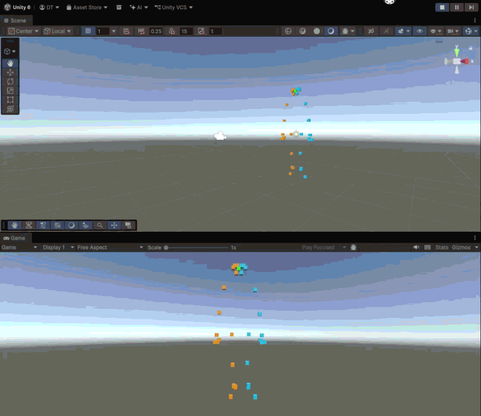

# PoseBridge

Real-time markerless motion capture into Unity, with movement-quality scoring.

> **Status: in progress, started 29 Sept 2026.** M0 and M1 work end to end (webcam → pose → UDP → Unity, with joints drawn as cubes). The avatar, squat analyser and measurements are still to come. Last updated 8 Oct 2026.



## What it does

A webcam watches a person. A pose-estimation model turns each frame into a skeleton of 33 body landmarks. The skeleton is streamed over UDP into Unity, which draws it live. Every packet carries a capture timestamp, so end-to-end latency can be measured rather than guessed.

Planned next: drive a rigged humanoid avatar with smoothing, then judge one movement, the squat (knee angle at depth, knee valgus, rep tempo), and count repetitions.

## Architecture

```
[ webcam ] -> PERCEPTION (Python) -> BRIDGE (UDP) -> PRESENTATION (Unity / C#)
              OpenCV, MediaPipe,     localhost,       background socket thread,
              (smoothing, squat      JSON per frame   joint cubes (avatar, HUD
              analysis planned)      + timestamp      planned)
```

- **Perception** (`perception/`, `tools/stream_pose.py`): captures frames, runs the pose model behind a small `PoseSource` interface so the model can be swapped, and encodes one JSON packet per frame.
- **Bridge** (`perception/packet.py`, `perception/udp.py`): UDP on `127.0.0.1:5005`. Packets are small (about 1 KB) and carry a frame counter, a Unix-time capture timestamp and a flat joint array. UDP is used on purpose: a stale frame is worthless, so lost packets are not resent.
- **Presentation** (`unity/PoseBridgeUnity/Assets/Scripts/`): `UdpReceiver.cs` listens on a background thread and hands the newest packet to the main thread; `JointCubes.cs` converts image coordinates (y down, un-mirrored) into Unity space and moves 33 cubes.

## Milestones

- [x] **M0**: Keypoints on screen (webcam feed with a skeleton drawn on it, FPS printed)
- [x] **M1**: End-to-end: Unity cubes move when I move
- [ ] **M2**: Real humanoid avatar, with smoothing
- [ ] **M3**: Squat analyser: knee angle, valgus flag, rep counter, score on a HUD
- [ ] **M4**: Measured results (latency p50/p95, FPS, rep-count accuracy, knee-angle error on ~50 hand-labelled clips) and write-up

## Stack

Python 3.12, OpenCV, MediaPipe, NumPy, Unity 6 (6000.4.9f1), C#. PyTorch is planned for the model-training milestone.

## How to run

Tested on Windows 11 only.

```powershell
git clone https://github.com/CodeWithDannyy/posebridge.git
cd posebridge
py -3.12 -m venv .venv
.venv\Scripts\Activate.ps1
python -m pip install -r requirements.txt
python -m tools.download_model
python -m pytest
```

1. Open `unity/PoseBridgeUnity` in Unity 6000.4.9f1, open `SampleScene` and press **Play**. The Console should print `UdpReceiver listening on 127.0.0.1:5005`.
2. In a terminal with the venv active: `python -m tools.stream_pose`. Stand back so your whole body is in frame. Press `q` in the camera window to quit.

To check the Python side without Unity, run `python -m tools.udp_receiver` in one terminal and `python -m tools.stream_pose` in another; the receiver prints packets per second, dropped packets and latency.

## Results

Preliminary, informal numbers from a single run in the Unity Editor (laptop CPU, 640×480 webcam at 30 fps). Proper median and 95th-percentile figures come in M4.

| Measure | Value |
|---|---|
| Throughput | about 30 packets/s, 0 dropped in a 40 s run |
| Capture → socket (mostly pose-model time) | about 9 ms |
| Socket → Unity `Update()` | about 1 to 2 ms (Unity at about 400 fps) |

The capture timestamp is taken when the frame reaches the Python code, so the camera's own internal delay is not included.

## Limitations and next steps

- Joints are shown as cubes only: no avatar yet, and no smoothing, so the skeleton jitters.
- The squat analyser, rep counting and validation against hand-labelled clips have not been built.
- Depth (z) from the single-camera model is noisy, so the Unity view is flat (`Depth Factor = 0`).
- The model's `visibility` score drops for joints outside the frame but not reliably for occluded ones, and a joint can be estimated even when it is out of frame. The whole body must be in view for any analysis.
- If both hips are not confidently visible, the skeleton is hidden rather than held; holding the last good pose is planned.
- Latency was measured in the Unity Editor, which adds overhead; final numbers will come from a built player.
- MediaPipe is pinned to 0.10.21: the 1.0.x release ships an unsigned DLL that Windows Smart App Control can block.
